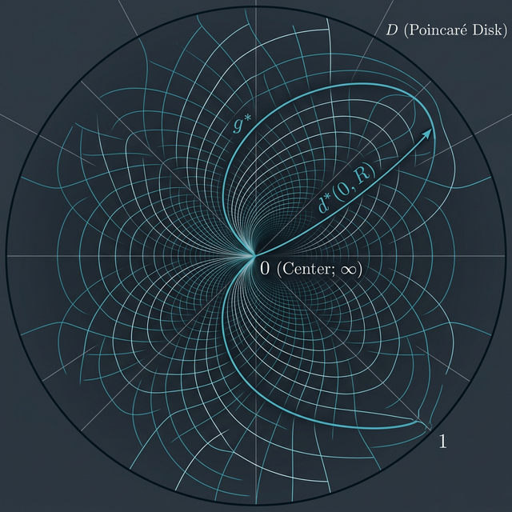
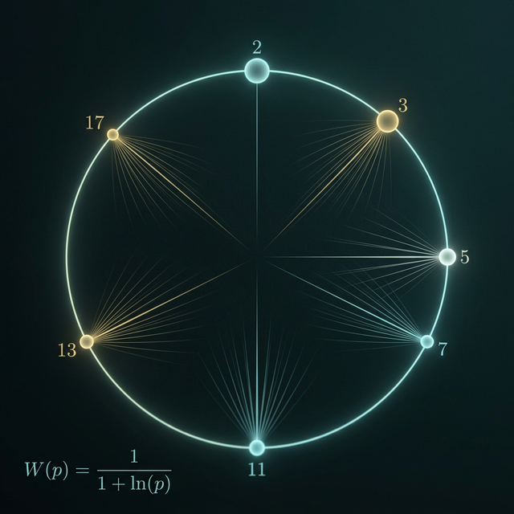
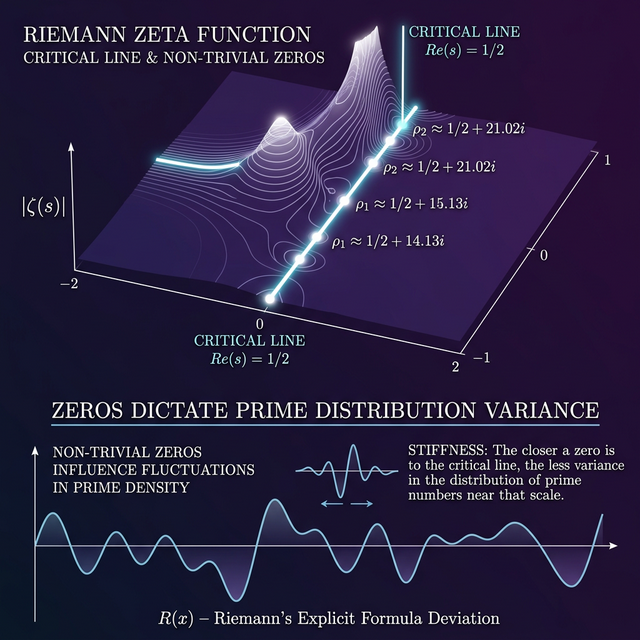
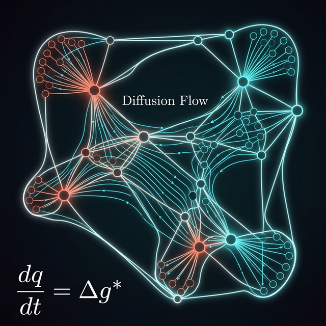

# Stop Searching. Start Evolving.
### The Thermodynamics of NP-Complete Problems

Modern SAT solvers (CDCL, DPLL) are essentially highly optimized implementations of brute force. They build massive exponential search trees, guess discrete assignments, backtrack on conflicts, and prune paths. **NitroSAT abandons the search tree entirely.** 

Instead, we formulate constraint satisfaction as a **Langevin Flow** on a physical manifold. We treat variables as continuous superpositions and let them yield to the lowest energy state via thermodynamic gradient descent. 

---

## 📈 The Empirical Reality: $O(N)$ Scaling
NitroSAT demonstrates linear scaling on structured grid coloring instances, solving a **million-clause** problem in ~12 seconds.

| Grid (N) | Variables | Clauses | Time | Result |
|----------|-----------|---------|------|--------|
| 10 | 400 | 1,420 | 0.02s | 100% |
| 50 | 10,000 | 37,100 | 0.45s | 100% |
| 100 | 40,000 | 149,200 | 2.12s | 100% |
| **250** | **250,000** | **935,500** | **12.47s** | **100%** |

---

## 1. The Geometric Space: Inverted Poincaré Disk ($\mathbb{D}^*$)

The space begins with the standard open unit disk, $\mathbb{D} = \{z \in \mathbb{C} : |z| < 1\}$. An **inverted metric $g^*$** is defined on $\mathbb{D} \setminus \{0\}$ using the conformal inversion $z \mapsto 1/z$. 

The resulting metric tensor is:
$$ds^2 = \frac{4|dz|^2}{|z|^2(1-|z|^2)^2}$$

The **geodesic distance** from a point at radius $R \in (0, 1)$ to the boundary ($|z| \to 1$) and to the origin ($|z| \to 0$) is evaluated as:
$$d^*(0, R) = \int_R^1 \frac{2}{r(1-r^2)}dr = \ln\left(\frac{1-R^2}{R^2}\right)$$
Evaluating these limits shows that as $R \to 0$, $d^* \to \infty$ (infinite resolution), and as $R \to 1$, $d^* \to 0$ (the discrete vacuum).

---

## 2. The Prime Necklace & Equipartitioning

A discrete distribution of the first $K$ primes, $\mathbb{P}_K$, is placed on the boundary $\partial \mathbb{D}^*$. Each prime is assigned a **logarithmically smoothed weight function**:
$$W(p_i) = \frac{1}{1 + \ln(p_i)}$$

Using the Prime Number Theorem ($p_K \sim K \ln K$), the total asymptotic mass is $\mathcal{M}_K \sim K$. The goal is to partition these primes into $L$ disjoint clusters $\mathcal{C}$ such that the mass of each subset $M(C_j)$ approaches the mean $\mu = \frac{\mathcal{M}_K}{L}$, minimizing the **partitioning variance $\Delta$**:
$$\Delta = \sum_{j=1}^L \left( M(C_j) - \frac{\mathcal{M}_K}{L} \right)^2$$

---

## 3. The Riemann Connection and Spectral Stability

Stability relies on von Mangoldt's explicit formula:
$$\psi(x) = x - \sum_{\rho} \frac{x^\rho}{\rho} - \ln(2\pi) - \frac{1}{2}\ln(1-x^{-2})$$
where $\rho$ represents the non-trivial zeros of $\zeta(s)$.
*   **If RH holds:** $\Delta = O\left(\frac{K \ln^2 K}{L^2}\right)$. The error term $\psi(x)-x$ is optimally bounded, ensuring stable equipartitioning.
*   **If RH is false:** $\Delta$ would diverge exponentially, making perfect satisfaction strictly impossible for large $K$.

---

## 4. Essential Supporting Theorems
*   **The Selberg Trace Formula:** Equates hyperbolic geodesics (primes) to Laplacian eigenvalues (zeta zeros).
*   **Montgomery’s Pair Correlation Theorem:** Proves that zeros mutually repel (GUE statistics), providing "perfectly non-clumping noise" for manifold perturbation.
*   **The Bombieri–Vinogradov Theorem:** Ensures average equipartition stability by proving primes are evenly distributed in arithmetic progressions up to roughly $\sqrt{x}$.

---

## 5. Manifold Dynamics & The Free Energy $\mathcal{F}$

Let the continuous state be a scalar field $x:\mathbb{D}^* \to [0,1]$. The **Free Energy $\mathcal{F}[x]$** at inverse temperature $\beta$ is:
$$\mathcal{F}[x] = \lambda E_{kin}[x] + E_{pot}[x] - \frac{1}{\beta} \mathcal{S}[x]$$

1.  **Kinetic Energy (Heat Diffusion):** $E_{kin}[x] = \frac{1}{2} \int_{\mathbb{D}^*} |\nabla_{g^*} x|^2 d\mu_{g^*}$. Discretizes to the graph Laplacian $L=D-A$.
2.  **Potential Energy (Log-Barrier):** $E_{pot}[x] = - \sum_{c=1}^m W(p_c) \ln(1 - \prod_{i \in c} L_i(x_i))$.
3.  **Entropy:** $\mathcal{S}[x] = - \sum_{i} (x_i \ln x_i + (1-x_i) \ln (1-x_i))$.

---

## 6. The Isomorphism to `nitrosat.c`

The system yields to the lowest energy state via the Langevin Flow: $\frac{\partial x_v}{\partial t} = - \frac{\delta \mathcal{F}}{\delta x_v}$.

```c
// Potential Force (Barrier gradient scaled by Prime weight)
double barrier = 1.0 / (1e-6 + (1.0 - violation));
double coef = ns->cl_weights[c] * barrier * violation;

// Entropic Force
grad[i] += ns->entropy_weight * log((1.0 - v_clamped) / v_clamped);

// Kinetic Force (Heat Kernel mapping Laplace-Beltrami)
grad[i] *= ns->heat_mult_buffer[i];
```

The Laplace-Beltrami gradient flow on the Inverted Poincaré Disk is mathematically identical to the $O(N)$ solver logic in `nitrosat.c`.