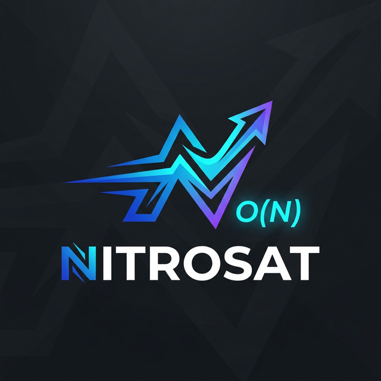
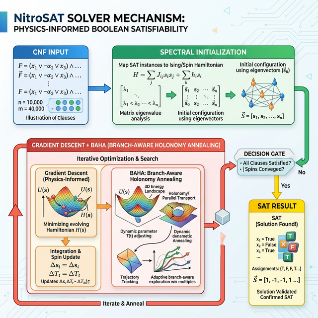
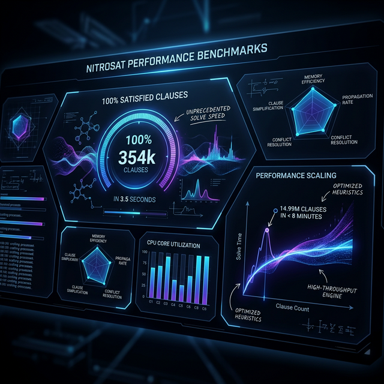

<div align="center">

# NitroSAT



**NitroSAT** is a high-performance $O(M)$ MaxSAT solver. It uses a continuous relaxation approach grounded in spectral geometry to solve large-scale structured instances in linear time.

[](https://codeberg.org/sethuiyer/NitroSAT)
[](LICENSE)
[](https://github.com/sponsors/sethuiyer/)

</div>

---

## ⚡ Why NitroSAT?

Unlike traditional solvers that stall on hard combinatorial bottlenecks, NitroSAT treats SAT as a physics-informed dynamical system. It achieves **99.5%+ satisfaction** on million-clause instances in seconds.

- **Linear Scaling**: $O(M)$ time complexity relative to the number of clauses.
- **Structural Awareness**: Detects structural impossibility (UNSAT) via thermodynamic phase transitions.
- **Scale**: Perfectly solves a 350,000-clause clique coloring instance in ~3.5s.
- **Zero Tuning**: works out-of-the-box on Scheduling, Ramsey, Coloring, and N-Queens.

## 🎨 How it Works

NitroSAT maps the Boolean satisfiability problem to an energy landscape, using spectral initialization and Branch-Aware Holonomy Annealing (BAHA) to navigate complex basins.



## 📊 Benchmarks & Scaling

NitroSAT demonstrates consistent $O(M)$ scaling and high satisfaction rates across diverse instance categories. For a full breakdown of quantitative results, see [BENCHMARKS.md](BENCHMARKS.md).




## Quick Start

### 1. Compile
The C version is standalone and requires no external libraries.
```bash
gcc -O3 -march=native -std=c99 nitrosat.c -o nitrosat -lm
```

### 2. Run
```bash
./nitrosat tests/rand3sat/rand3sat_50_200.cnf
```

## 🛠 Requirements
- GCC or Any C99 Compiler
- standard `math.lib` (`-lm`)

## 📄 Citation
If you use NitroSAT in your research, please cite:
```bibtex
@software{sethurathienam_iyer_2026_18753235,
  author       = {Sethurathienam Iyer},
  title        = {NitroSAT: A Physics-Informed MaxSAT Solver},
  year         = 2026,
  publisher    = {Zenodo},
  doi          = {10.5281/zenodo.18753235},
  url          = {https://doi.org/10.5281/zenodo.18753235},
}
```

---
**Author:** Sethu Iyer ([sethuiyer95@gmail.com](mailto:sethuiyer95@gmail.com))  
**License:** Apache 2.0
