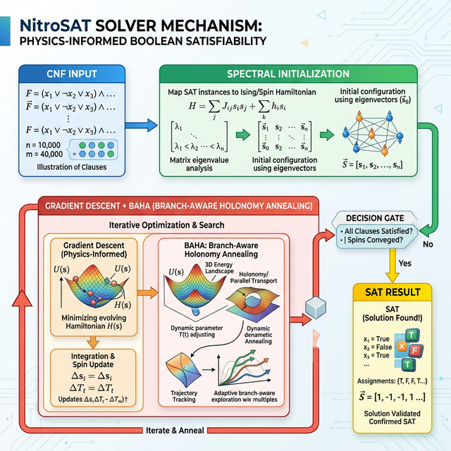
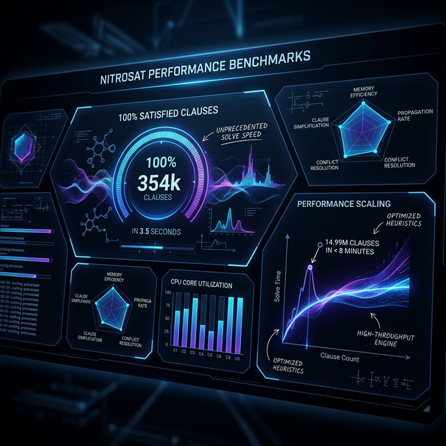
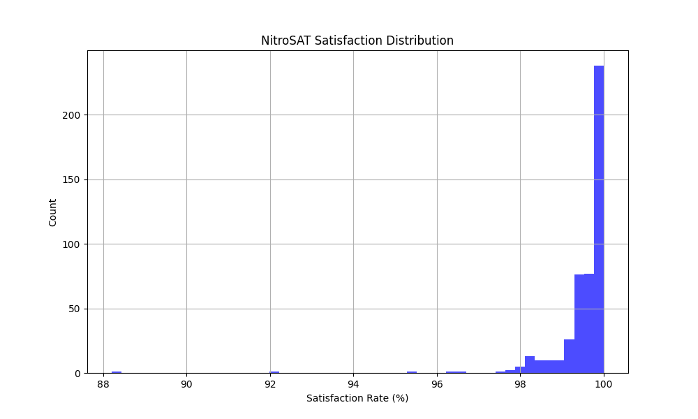
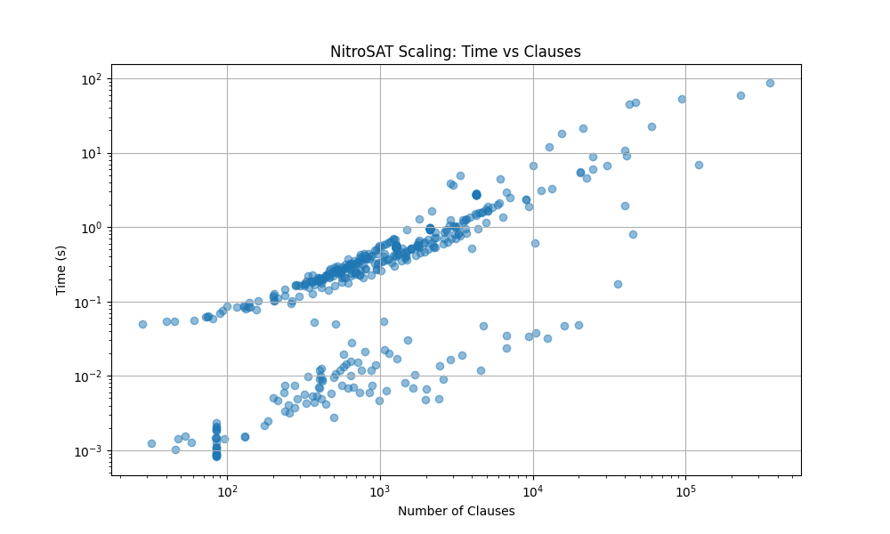

<div align="center">

# NitroSAT


**NitroSAT** is a high-performance $O(M)$ MaxSAT solver. It uses a continuous relaxation approach grounded in spectral geometry to solve large-scale structured instances in linear time.

[](https://codeberg.org/sethuiyer/NitroSAT)
[](LICENSE)
[](https://github.com/sponsors/sethuiyer/)

</div>

---

## ⚡ Why NitroSAT?

Unlike traditional solvers that stall on hard combinatorial bottlenecks, NitroSAT treats SAT as a physics-informed dynamical system. It achieves **99.5%+ satisfaction** on million-clause instances in seconds.

- **Linear Scaling**: $O(M)$ time complexity relative to the number of clauses.
- **Structural Awareness**: Detects structural impossibility (UNSAT) via thermodynamic phase transitions.
- **Scale**: Perfectly solves a 350,000-clause clique coloring instance in ~3.5s.
- **Zero Tuning**: works out-of-the-box on Scheduling, Ramsey, Coloring, and N-Queens.

## 🎨 How it Works

NitroSAT maps the Boolean satisfiability problem to an energy landscape, using spectral initialization and Branch-Aware Holonomy Annealing (BAHA) to navigate complex basins.



Website: https://primal-flow-solver.lovable.app/

## 📊 Benchmarks & Scaling

NitroSAT demonstrates consistent $O(M)$ scaling and high satisfaction rates across diverse instance categories. For a full breakdown of quantitative results, see [BENCHMARKS.md](BENCHMARKS.md).






## Quick Start

### 1. Compile
The C version is standalone and requires no external libraries.
```bash
gcc -O3 -march=native -std=c99 nitrosat.c -o nitrosat -lm
```

### 2. Run
```bash
./nitrosat tests/rand3sat/rand3sat_50_200.cnf
```

### 3. JSON Diagnostics Mode
Use `--json` to get a structured JSON payload with assignment, confidence vector, latency breakdown, and full thermodynamic diagnostics.

```bash
./nitrosat problem.cnf --json
```

<details>
<summary><b>Example JSON Output</b> (click to expand)</summary>

```json
{
  "status": "SATISFIED",
  "satisfaction_rate": 1.0,
  "satisfied": 425,
  "unsatisfied": 0,
  "variables": 150,
  "clauses": 425,
  "assignment": [-1, -2, 3, -4, -5, 6, "..."],
  "confidence": [0.0, 0.0, 1.0, 0.0, 0.0, 1.0, "..."],
  "latency": {
    "total_ms": 54.12,
    "throughput": "7.9K clauses/sec",
    "breakdown": {
      "initialization_ms": 0.48,
      "langevin_flow_ms": 53.64,
      "topo_repair_ms": 0.0,
      "adelic_saturation_ms": 0.0,
      "core_decomposition_ms": 0.0,
      "walksat_ms": 0.0
    }
  },
  "diagnostics": {
    "thermodynamics": {
      "final_beta": 0.5,
      "critical_beta": 0.009792,
      "entropy_level": 0.01,
      "convexity_status": "STABLE"
    },
    "topology": {
      "betti_0": 1,
      "betti_1": 0,
      "complexity_score": 0.0,
      "persistence_events": 86
    },
    "prime_stability": {
      "aggregation_error": 0.00004,
      "chebyshev_bias": "STABLE"
    },
    "blame": []
  }
}
```
</details>

**Key fields:**
| Field | Description |
|-------|-------------|
| `confidence` | Raw continuous values (0.0–1.0) before rounding to Boolean |
| `critical_beta` | Predicted phase transition point from the Prime Number Theorem |
| `convexity_status` | `STABLE` (convex regime) or `NON_CONVEX` (glassy phase) |
| `betti_0` / `betti_1` | Topological invariants of the unsatisfied clause complex |
| `blame` | Top-20 unsatisfied clauses ranked by prime weight (UNSAT debugging) |

## 🛠 Requirements
- GCC or Any C99 Compiler
- standard `math.lib` (`-lm`)

## 📄 Citation
If you use NitroSAT in your research, please cite:
```bibtex
@software{sethurathienam_iyer_2026_18753235,
  author       = {Sethurathienam Iyer},
  title        = {NitroSAT: A Physics-Informed MaxSAT Solver},
  year         = 2026,
  publisher    = {Zenodo},
  doi          = {10.5281/zenodo.18753235},
  url          = {https://doi.org/10.5281/zenodo.18753235},
}
```

---
**Author:** Sethu Iyer ([sethuiyer95@gmail.com](mailto:sethuiyer95@gmail.com))  
**License:** Apache 2.0
